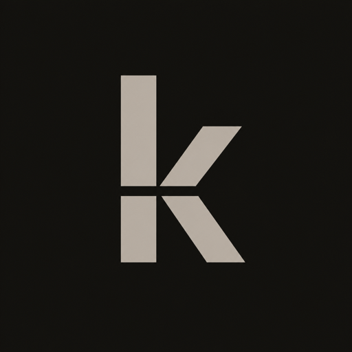

# kDrive Connector

<p align="center">
  
</p>

A path-first Model Context Protocol connector that gives ChatGPT Work, Codex,
and other MCP clients natural, controlled read/write access to Infomaniak kDrive.

The connector uses Infomaniak's documented API-token or OAuth 2 authentication
and the kDrive REST API. It does not send file contents to a second AI service.
The host model decides which tool to call; this server performs exact API
operations.

## Why this exists

This project grew out of my interest in diversifying my personal technology
stack away from an exclusively US-based ecosystem, and especially from making
Google Drive the default home for every document. Infomaniak is a Swiss
provider, and kDrive gives me a credible European-hosted file workspace; the
missing piece was a first-class AI workflow comparable to the integrations
available for the largest US platforms.

The goal is not to argue that every US service is undesirable. It is to reduce
vendor and jurisdiction concentration, preserve meaningful provider choice,
and demonstrate that open protocols can give independent storage platforms an
equally natural agent experience. MCP is central to that approach: the file
provider, AI host, authentication layer, and workflow instructions remain
separable instead of becoming one closed stack.

Using this connector does not by itself create data sovereignty. A file's
contents are shared with the AI host when the user explicitly asks the host to
read or process that file. The connector does, however, avoid routing those
contents through an additional AI service, keeps the kDrive credential out of
the model, and limits every operation to the tools and permissions described
below.

## Included tools

- Check the selected drive connection
- Browse folders and retrieve file details by natural path
- Search filenames and supported document content with short previews and an inline result card containing private Open in kDrive buttons
- Read files as converted text or base64
- Create folders and upload new files without overwriting existing names
- Rename, move, overwrite, and trash items through one normal host approval
- Restore recoverable items from trash

The connector accepts paths such as `/Private/Projects/brief.docx`; its public tool schemas contain no file IDs, folder IDs, or ETags. Sensitive changes use short-lived, one-use signed operation tokens bound to the resolved target, requested action, current file version, and exact replacement content when applicable. The token exchange stays internal while the host presents one ordinary approval. Permanent deletion and empty-trash operations are deliberately not exposed.

## Architecture

The repository contains two runtimes built on the same kDrive client, tool
definitions, workflow instructions, and safety rules:

- The root package is a local stdio MCP server. It reads its Infomaniak token
  from macOS Keychain or a user-only token file.
- [`remote/`](remote/) is an OAuth 2.1-protected Streamable HTTP server on
  Cloudflare Workers. GitHub verifies the connecting user, an allowlist limits
  access to the owner, and the Infomaniak token stays in Cloudflare's encrypted
  secret store.

```text
ChatGPT Work ── MCP OAuth 2.1 ──> Cloudflare Worker ── server-side token ──> kDrive API
                                      │
                                      └── GitHub login + owner allowlist
```

No kDrive credential is sent to ChatGPT or committed to Git. The host model
decides which tool to call; the server performs exact API operations.

## Local runtime

### 1. Install dependencies and build

```bash
npm install
npm run build
npm test
```

Node.js 20 or newer is required.

### 2. Configure the drive

Copy the example configuration and set the numeric drive ID shown in the kDrive
browser URL:

```bash
cp .env.example .env
```

The local `.env` is ignored by Git and is loaded automatically by the MCP
server.

### 3. Authenticate with an API token

Create a token in Infomaniak Manager with only the `drive` scope. Copy it, then
pipe it into the setup command so it is never present in shell history:

```bash
pbpaste | npm run token:save
```

On macOS, the token is stored in Keychain. On other platforms, it is stored in
the same user-only configuration directory as OAuth tokens. It is never written
to this project.

### Optional: Infomaniak OAuth application flow

OAuth is available for Infomaniak applications that have been authorised to
request the required kDrive product scope. Register this redirect URI exactly:

```text
http://127.0.0.1:53682/callback
```

Infomaniak documents the authorization endpoint as `https://login.infomaniak.com/authorize`, the token endpoint as `https://login.infomaniak.com/token`, and the kDrive product scope as `drive`.

Set the application credentials in the ignored `.env`, then authenticate:

```bash
npm run auth
```

The browser opens Infomaniak's consent screen. Tokens are saved in a user-only file outside this repository. On macOS, the client secret is stored in Keychain for refreshes. It is never written to this project.

The numeric drive ID appears after `/drive/` in the kDrive browser URL.

### 4. Run locally

```bash
npm start
```

The repository includes `.mcp.json` for clients that launch the local stdio
server directly. Build before registering that local server. The packaged
workflow plugin intentionally uses the authenticated remote connection through
`.app.json`, so installing it does not copy a local `.env` or token into the
plugin.

## Remote runtime for ChatGPT Work

The remote server exposes Streamable HTTP at `/mcp` and implements OAuth
discovery, dynamic client registration, PKCE, bearer-token validation, and
GitHub identity verification. See [`remote/README.md`](remote/README.md) for the
deployment and ChatGPT connection guide.

## Complete ChatGPT and Codex plugin

The repository is also packaged as a complete plugin rather than only an MCP
server:

- `.codex-plugin/plugin.json` supplies the install identity, discovery copy,
  capabilities, artwork, and starter prompts.
- `.app.json` maps the package to the registered authenticated remote connector.
- `skills/manage-kdrive-files/` supplies the workflow that makes ordinary
  requests such as “find my latest invoice in kDrive” work without exposing
  connector internals.
- `assets/` contains the connector icon and logo used by supported install
  surfaces.

The combined experience has been tested in a fresh Codex session against the
deployed OAuth-protected server: the skill selected the connector
automatically, reused the authenticated account, checked connection health,
listed the root directory, and returned a private **Open in kDrive** link. No
file was modified during that smoke test.

For local development, add the plugin directory to a personal or repository
marketplace, install `kdrive-connector` from the Plugins directory, restart the
desktop host, and test it in a new conversation. A self-hosted fork should
replace the app ID in `.app.json` with the technical ID of its own registered
MCP connection. The current deployment and its GitHub allowlist are owner-only;
the repository contains the development source, but the deployed connector is
not yet a universally available hosted kDrive service.

## Safety behavior

- Read/search tools run directly.
- New folders and new-file uploads are non-destructive writes and never overwrite on name conflict.
- Writes use MCP annotations so ChatGPT or another host can show its native approval UI. The recommended app permission is **Allow read actions**, which asks once before each write.
- Rename and move resolve exact paths and fail safely on name conflicts.
- Rename, move, overwrite, and trash require a short-lived one-use operation token that binds the target and readable arguments. The model prepares and supplies it internally; the user never copies a phrase or token.
- Overwrite binds and enforces the current file version and an exact digest of the replacement bytes, preventing a stale or substituted write.
- Trash is recoverable through an opaque undo token; permanent-delete API operations are not available.
- Results contain private, expiring Open in kDrive redirect links instead of public share links. Search adds bounded text previews when conversion is supported and a concise type/size preview otherwise. ChatGPT-compatible hosts also receive a native MCP Apps result card with clickable Open in kDrive buttons; structured data, resource links, and Markdown remain available as fallbacks.
- Reads default to 2 MiB and uploads to 10 MiB. Override with `KDRIVE_MAX_READ_BYTES` and `KDRIVE_MAX_UPLOAD_BYTES`.

The included `manage-kdrive-files` skill teaches compatible hosts when to select kDrive, how to run the internal prepare/write protocol, how to present previews and readable links, and how to keep connector internals out of normal conversation. The packaged `.app.json` maps that skill to the registered remote connector. If a user asks only to preview a change, the skill prevents both prepare and write tools from running.

## Development checks

```bash
npm run check
npm test
npm run build
cd remote && npm ci && npm run type-check
```

The automated tests use local mock HTTP responses. Live kDrive calls require
your Infomaniak credentials and are intentionally not run during the normal
test suite.
